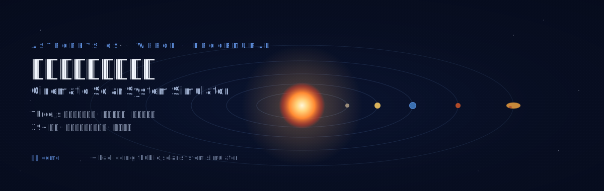

<p align="center">
  
</p>

<p align="center">
  <a href="https://kael-odin.github.io/solar-system-simulator/"><strong>🌐 在线体验 · Live Demo</strong></a>
  &nbsp;·&nbsp;
  <a href="https://github.com/kael-odin/solar-system-simulator">源码 · Source</a>
  &nbsp;·&nbsp;
  <a href="./REALISM.md">真实对标</a>
  &nbsp;·&nbsp;
  <a href="./ROADMAP.md">路线图</a>
  &nbsp;·&nbsp;
  <a href="./SIMULATOR-SERIES.md">系列规划</a>
</p>

<p align="center">
  
  
  
  
  
</p>

---

> 一个打开即用的、电影级的太阳系。每一颗天体的表面都由 GLSL 着色器在浏览器里实时生成 —— 没有一张外部贴图，没有一个模型文件。

## ✨ 这是什么

一个用 Three.js 构建的**全程序化太阳系模拟器**。太阳的沸腾等离子体、木星的大红斑螺旋、冥王星的汤博区爱心、土星环的卡西尼缝 —— 全部用多层分形噪声（FBM / 湍流 / 细胞噪声）在着色器里算出来，叠加 `UnrealBloomPass` 后期泛光，单文件即可运行。

**点击上面的「在线体验」即可打开**，双击任意天体聚焦飞行。

## 🪐 天体清单

| 类别 | 内容 |
|------|------|
| ☀️ 恒星 | 太阳（等离子体表面 + 3 层体积日冕 + 黑子 + 太阳风粒子） |
| 🌍 八大行星 | 水星 · 金星 · 地球 · 火星 · 木星 · 土星 · 天王星 · 海王星 |
| 🌙 命名卫星 | 月球 · 火卫一/二 · 木卫一/二/三/四 · 土卫六/二/一/八 · 海卫一 |
| 🟤 矮行星 | 冥王星(汤博区爱心) · 谷神星 · 阋神星 · 鸟神星 · 妊神星(椭球) · 共工星 · 创神星 · 亡神星 · 厄耳枯斯 |
| ☄️ 带状结构 | 小行星带（320+ 不规则体）· 柯伊伯带 · 奥尔特云 |
| 🌌 深空 | 8000+ 闪烁星点 · 随机流星 · 镜头光晕 |
| 🛰️ 已探索 | 信息面板附带各天体的真实探测任务记录 |

## 🎯 核心特性

**写实视觉** — 每个天体自定义着色器，FBM/湍流/细胞/脊状噪声多层叠加
- 木星大红斑带螺旋涡旋结构，条带随时间演化
- 地球独立云层球壳慢速旋转 + 夜面城市灯光 + 海洋镜面
- 土星环 discard 粒子散射 + 卡西尼缝 + 内外色彩渐变
- 冥王星汤博区用心形 SDF 呈现自然边缘过渡

**真实轨道力学** — 开普勒方程牛顿迭代
- 椭圆轨道 + 真实偏心率（水星 0.21、冥王星 0.25）
- 真实轨道倾角（冥王星 17° 显著可见）+ 升交点经度
- 天王星 98° 侧躺自转
- 可切换「真实尺度」对数压缩模式

**完整交互**
- 双击聚焦飞行 · 单击选中 · 5 个预设视角
- 中英文模糊搜索 · 磨砂玻璃信息/控制面板
- 时间倍率 0–1000× · 公转方向切换 · 亮度/星空密度调节
- 6 个成就（localStorage 持久化）· Tab/方向键键盘导航
- 中英文一键切换 · 移动端响应式

## 🚀 运行

纯静态，零构建。ES module 需 `http://` 而非 `file://`：

```bash
python -m http.server 8000
# 打开 http://localhost:8000
```

或直接访问在线版：**https://kael-odin.github.io/solar-system-simulator/**

## 🛠️ 技术栈

- **Three.js r160** — 经 importmap 引入 CDN，零打包
- **EffectComposer + UnrealBloomPass** — 后期泛光
- **自定义 GLSL** — 单一噪声库 (`src/shaders/noise.glsl.js`) 复用于所有天体
- **CSS2DRenderer** — 天体标签
- **质量三档** — 启动按 GPU 自动检测，分段数/星点数/Bloom/阴影按档降级

## 📁 项目结构

```
index.html              入口、importmap、CSS
src/main.js             场景、相机、渲染循环、Bloom
src/quality.js          质量/平衡/性能三档配置
src/orbit.js            开普勒椭圆轨道力学
src/scalemode.js        观感/真实尺度切换
src/shaders/            GLSL 噪声库 + 着色器辅助
src/bodies/             sun / planet / moon / dwarf / saturnRings / belts / background
src/data/bodies.js      天体元数据 + 探测任务 + 系外行星
src/ui/                 panels / camera / search / i18n / achievements
```

## 📐 真实性与局限

详见 [REALISM.md](./REALISM.md)。要点：
- 轨道形状、倾角、偏心率为真实值；公转速度为近似（未严格 a^1.5）
- 天体相对大小为观感缩放（否则内行星不可见），可切真实尺度模式
- `ShaderMaterial` 无法自动 receiveShadow，土星环阴影用 MultiplyBlending 暗环替代

## 🗺️ 路线图

详见 [ROADMAP.md](./ROADMAP.md)。下一步重点：全行星轴倾角、时间旅行模式、哈雷彗星、LOD 性能优化。

## 🔭 系列规划

这是「天体物理模拟器系列」的第一个。后续方向见 [SIMULATOR-SERIES.md](./SIMULATOR-SERIES.md) —— 黑洞时空、星系动力学、恒星演化、系外行星等。

## 📄 许可

[MIT](./LICENSE) · 自由使用、修改、分发。

<p align="center">
  <sub>用 ❤️ 与 GLSL 构建 · Made with Three.js & procedural noise</sub>
</p>
